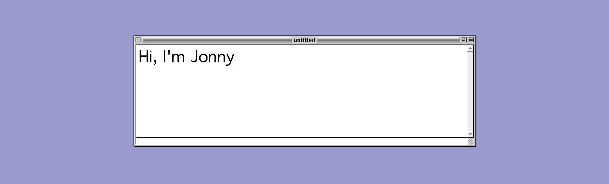
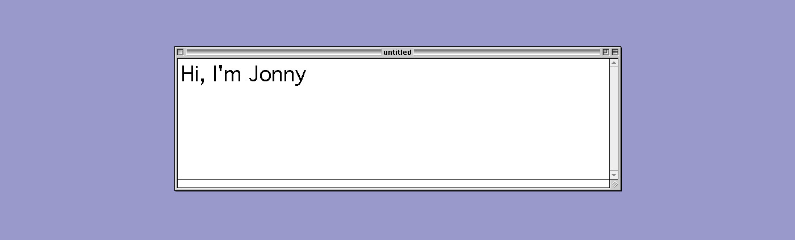

# Banner.png

# Banner.jpg

# Banner-lo.png

# Banner-hi.jpg

# About Me
I'm a computing student currently finishing my final year at Edinburgh Napier University.   
(this is currently a work in progress it will be updated)

# Personal Projects
Personal Projects are currently on hold as I finish my degree, most of my time is spent working on my honours project.

# Univsersity Work
Modules that were not programming based do not have GitHub Repositories and aren't included in this table.   
(n/a = work not on GitHub)   

## Year 4
|                | Honours Project | Multi-Agent Systems | Software Architecture | Computational Intelligence | Formal Approaches to Software Engineering |
|----------------|-----------------|---------------------|-----------------------|----------------------------|-------------------------------------------|
| Languages      | Python Flask, HTML, CSS | Java, JADE | Java | Java | Ada-SPARK |
| Coursework     | [Honours Project](https://github.com/jonny-binns/Honours-Project)|  [Coursework](https://github.com/jonny-binns/MultiAgentSystemsCoursework) | n/a | Currently being worked on in a private repo | Currently being worked on in a private repo |
| Practical Work | n/a | [Practicals](https://github.com/jonny-binns/MultiAgentSystemsPracticals) | [Practicals](https://github.com/jonny-binns/SoftwareArchitecturePracticals) | n/a | n/a |

## Year 3
|                | Advanced Web-Technologies | Artificial Intelligence | Data Analytics | Advanced Database Systems |
|----------------|---------------------------|-------------------------|----------------|---------------------------|
| Languages      | Python, Flask, HTML, CSS, Linux/Bash Scripting | Java, Windows Script | R | Oracle NoSQL |
| Coursework     | n/a | [Coursework](https://github.com/jonny-binns/ArtificialIntelligenceCW) | [Coursework 1](https://github.com/jonny-binns/DataAnalyticsCW) Coursework 2 was report based so not on GitHub | n/a |
| Practical Work | [Practicals](https://github.com/jonny-binns/set09103) | n/a | [Practicals](https://github.com/jonny-binns/DataAnalytics) | n/a |

## Year 2
|                | Database Systems | Object Oriented Development | Algorithms and Data Structures | Software Engineering Methods| Web Technologies |
|----------------|------------------|-----------------------------|--------------------------------|-----------------------------|------------------|
| Languages      | SQL | C#, .net | C | Java, Travis-ci, Docker, Kubernetes | HTML, JavaScript, Node.js |
| Coursework     | n/a | n/a |  [Coursework](https://github.com/jonny-binns/Binns_Jonathan_ads) | [Coursework](https://github.com/AlexanderRacey/group24_coursework) | [Coursework 1](https://github.com/jonny-binns/Binns_Jonathan_webtech_coursework1) [Coursework 2](https://github.com/jonny-binns/binns_jonathan_set008101_coursework2) |
| Practical Work | n/a | n/a | [Practicals](https://github.com/jonny-binns/set08122) | [Pracitcals](https://github.com/jonny-binns/sem) due to how the module was structured, I worked as part of a team to complete the coursework which was added to with each practical | [Practicals](https://github.com/jonny-binns/set08101) |

## Year 1
(I didn't use GitHub in first year so none of the projects have a repo, they will be added in time)